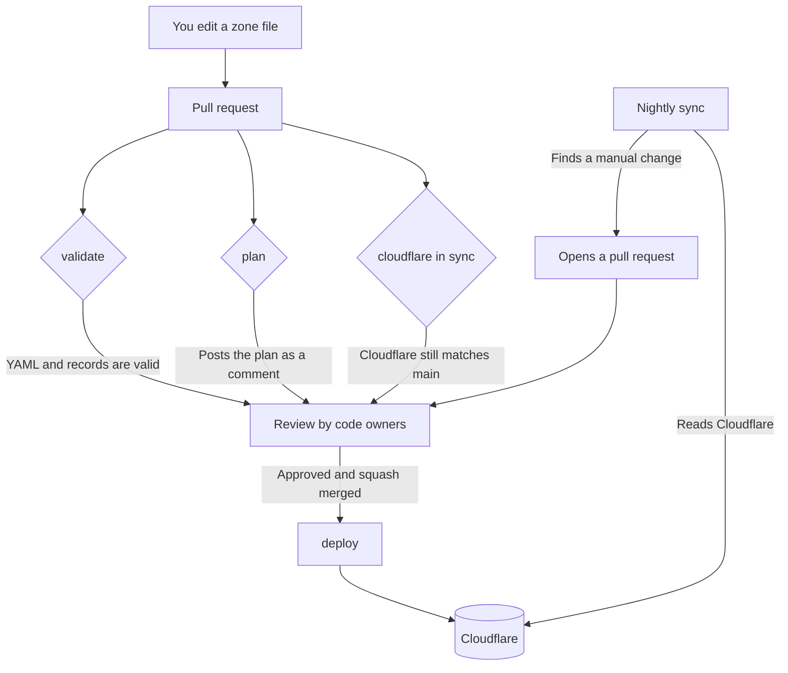

# Patchwork Labs DNS

[](https://github.com/patchworklabsorg/dns/actions/workflows/validate.yml)
[](https://github.com/patchworklabsorg/dns/actions/workflows/deploy.yml)
[](https://github.com/patchworklabsorg/dns/actions/workflows/sync-from-cloudflare.yml)

This repository holds the DNS records for Patchwork Labs. The YAML
files are the source of truth. [octoDNS](https://github.com/octodns/octodns)
applies them to Cloudflare when a pull request merges to `main`.

You get a subdomain by opening a pull request. You do not need Cloudflare
access.

## Managed domains

| Domain | Zone file | Used for |
|---|---|---|
| `patchworklabs.org` | [`patchworklabs.org.yaml`](./patchworklabs.org.yaml) | Patchwork Labs and its projects |
| `hackathon.help` | [`hackathon.help.yaml`](./hackathon.help.yaml) | Hackathon resources |

## Get a subdomain

### 1. Fork and edit

[Fork this repository](https://github.com/patchworklabsorg/dns/fork), then open the
zone file for the domain you want. Add your record in alphabetical order:

```yaml
docs: # ada@patchworklabs.org
  - ttl: 600
    type: CNAME
    value: docs-site.netlify.app.
```

That creates `docs.patchworklabs.org` and points it at `docs-site.netlify.app`.

Three rules decide whether it works:

- **The name is the part before the domain.** `docs` becomes `docs.patchworklabs.org`.
- **A `CNAME` value ends with a dot.** An `A` or `AAAA` value does not.
- **Every record needs an owner.** Put an email or a GitHub handle in a
  comment on the same line as the name, for example `# ada@patchworklabs.org`
  or `# @patchworklabsorg/infra`. We use it to find out who to ask when the
  record breaks. List more than one owner if more than one person is
  responsible. The `dns records` check fails on a record without an owner.

### Order is checked

The `dns records` check fails on a zone file that is out of order, so this is
a rule and not a request. The order is **natural**, not plain alphabetical:

- Records go in order by name, and `ns2` comes before `ns10`.
- The apex record, written `""`, comes first.
- Inside a record, `octodns` comes before `ttl`, `type` and `value`.

Run `./bin/validate` to check before you push. The nightly sync writes files
in this order by itself.

### Other checks

`./bin/validate` also runs [`tools/check_zones.py`](./tools/check_zones.py).
It fails when:

- A record has no owner comment, or only a `TODO owner unknown` comment.
- A TTL is lower than 120 seconds. Cloudflare raises a lower TTL to 120, so
  the zone file would never match Cloudflare.
- A zone file holds the apex `NS` records. Cloudflare owns them.
- A zone file holds the `octodns-meta` record. octoDNS writes it.
- A record that is not `A`, `AAAA` or `CNAME` is behind the Cloudflare proxy.
- A zone in `config/config.yaml` has no zone file, or a YAML file at the
  repository root is not a zone.
- One name appears twice in one file.

### 2. Open a pull request

A bot posts a **plan** on your pull request. It lists every record the merge
would create, change, or delete. Read it. If it shows something you did not
intend, fix your branch.

The code owners are asked to review automatically.

Push more commits to the same branch if the reviewer asks for changes. Do not
close the pull request and open a new one.

### 3. Wait for the deploy

Cloudflare gets the change within about a minute of the merge. Most resolvers
follow within the TTL. A few take up to 24 hours.

## Record types

| Type | Points at | Example value |
|---|---|---|
| `A` | An IPv4 address | `192.0.2.1` |
| `AAAA` | An IPv6 address | `2001:db8::1` |
| `CNAME` | Another domain | `example.com.` |
| `TXT` | Text, for verification or SPF | `"a-verification-string"` |
| `MX` | A mail server | See the zone file for the current setup |

### More than one record on one name

```yaml
docs: # ada@patchworklabs.org, grace@patchworklabs.org
  - ttl: 600
    type: CNAME
    value: docs-site.netlify.app.
  - ttl: 600
    type: TXT
    value: "a-verification-string"
```

### Behind the Cloudflare proxy

Add the `octodns` block to put a record behind Cloudflare:

```yaml
app: # ada@patchworklabs.org
  - octodns:
      cloudflare:
        proxied: true
    ttl: 300
    type: A
    value: 192.0.2.1
```

`octodns` comes before `ttl`. See **Order is checked** below.

## How it works



Four workflows do the work:

| Workflow | Runs when | Does what |
|---|---|---|
| [`validate`](./.github/workflows/validate.yml) | Every pull request | Checks the YAML, every record, and the tools tests. Holds no secrets, so it is safe on forks. |
| [`plan`](./.github/workflows/plan.yml) | Every pull request | Posts the plan as a comment, and fails if Cloudflare has drifted away from `main`. |
| [`deploy`](./.github/workflows/deploy.yml) | Push to `main` | Applies the zone files to Cloudflare, then confirms they match. Refuses a plan that deletes more than three records. |
| [`sync-from-cloudflare`](./.github/workflows/sync-from-cloudflare.yml) | Nightly | Pulls manual Cloudflare changes back into the zone files as a pull request. |

### Why the nightly sync exists

Cloudflare lets a team member change a record in the dashboard. octoDNS does
not know about that change, so the next deploy would undo it.

The nightly job reads Cloudflare, folds anything new into the zone files, and
opens a pull request. The change keeps its history and gets an owner. The
`cloudflare in sync` check blocks other merges until that pull request lands,
so nobody can overwrite the change by accident.

See [`docs/runbook.md`](./docs/runbook.md) for what to do when a check fails.

### The `octodns-meta` record

Every zone has a `octodns-meta` TXT record. octoDNS writes it on each deploy.
Use it to confirm that a deploy reached Cloudflare:

```console
$ dig +short TXT octodns-meta.patchworklabs.org
"octodns-version=1.14.0" "provider=cloudflare" "time=2026-09-21T07:17:03+00:00"
```

It only changes when something else in the zone changes, so it does not create
a deploy of its own every night. Do not add it to a zone file. The nightly sync
leaves it out on purpose.

## Work on this locally

You do not need a Cloudflare token to check your own change.

```console
$ python3 -m venv env
$ ./env/bin/pip install -r requirements.txt
$ export PATH="$PWD/env/bin:$PATH"

$ ./bin/validate     # parse the config and check every record
$ ./bin/zones        # list the zones this repository manages
```

These need a Cloudflare token in `CLOUDFLARE_TOKEN`. Ask a code owner for a
read-only one.

```console
$ ./bin/plan         # show what a deploy would change
$ ./bin/dump .live   # write the live Cloudflare state to .live/
```

`./bin/sync` applies to production. Only the `deploy` workflow should run it.

Run the tests for the sync tooling:

```console
$ ./env/bin/python -m unittest discover -s tools -p 'test_*.py' -v
```

## Who can approve and merge

The [infra](https://github.com/orgs/patchworklabsorg/teams/infra) and
[dns-frens](https://github.com/orgs/patchworklabsorg/teams/dns-frens) teams own
every file in this repository. A pull request needs an approving review from
one of those teams before it can merge.

[`CONTRIBUTING.md`](./CONTRIBUTING.md) covers the review rules.
[`docs/runbook.md`](./docs/runbook.md) covers the jobs a code owner has to do.

## Who can have a subdomain

Subdomains are for Patchwork Labs projects, events, and services. Ask on the
`infra` team if you are not sure whether yours counts.

## Get help

- Open an [issue](https://github.com/patchworklabsorg/dns/issues/new/choose).
- Read the [octoDNS documentation](https://octodns.readthedocs.io/en/stable/).
